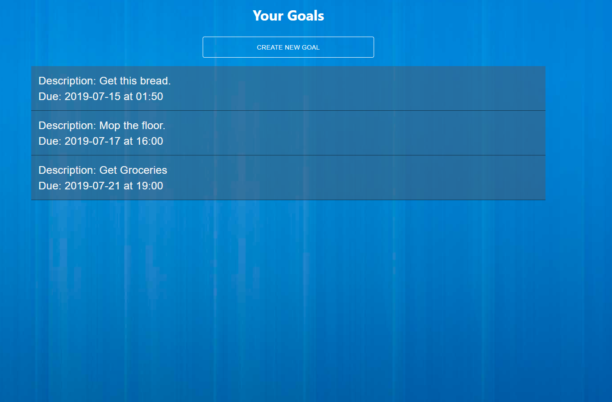
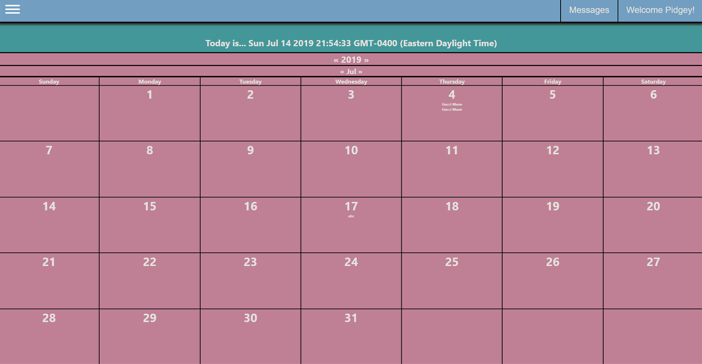
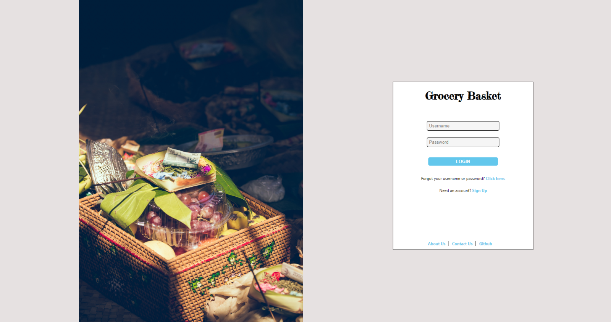

Here are a few projects that I am currently working on or completed.

## Teamster (in development)

An accountability partner app - meet people and reach your goals.

<a href='https://teamster.hanayu.codes' target='_blank'>Live Link</a> | <a href='https://github.com/moriie/teamster' target='_blank'>Github Repo</a>

## SimpleCalendar (on hold)

A simple calendar interface - make/schedule events. Currently outdated as my CSS has well developed beyond this. 
Ideally, would like to create a new npm package for calendars in the future.

<a href='https://simplecalendar.hanayu.codes' target='_blank'>Live Link</a> | <a href='https://github.com/moriie/Simple-Calendar-App' target='_blank'>Github Repo</a>

## Grocery List (in development)

Very barebones project right now. The linked version is to a JavaScript/React frontend, Python/Django backend project.
There is also a JavaScript/React frontend, JavaScript/Express backend version that may be found on my github.
This project will be developed as one which allows logins to create grocery lists for favored recipes.
However, I eventually want to turn it into a project which intakes PDFs of recipes and crafts grocery lists from those PDFs. 

<a href='https://groceries.hanayu.codes' target='_blank'>Live Link</a> | <a href='https://github.com/moriie/grocery_list' target='_blank'>Github Repo</a>

## The Tale of Eric (on hold)

A platformer game built using Phaser.

Eric is a new teaching assistant hungry for a promotion - but his troublesome students refuse to shower and stop playing League of Legends. Time to take matters into his own hands.

<a href='https://tale-of-eric.hanayu.codes' target='_blank'>Live Link</a> | <a href='https://github.com/moriie/eric_proj' target='_blank'>Github Repo</a>