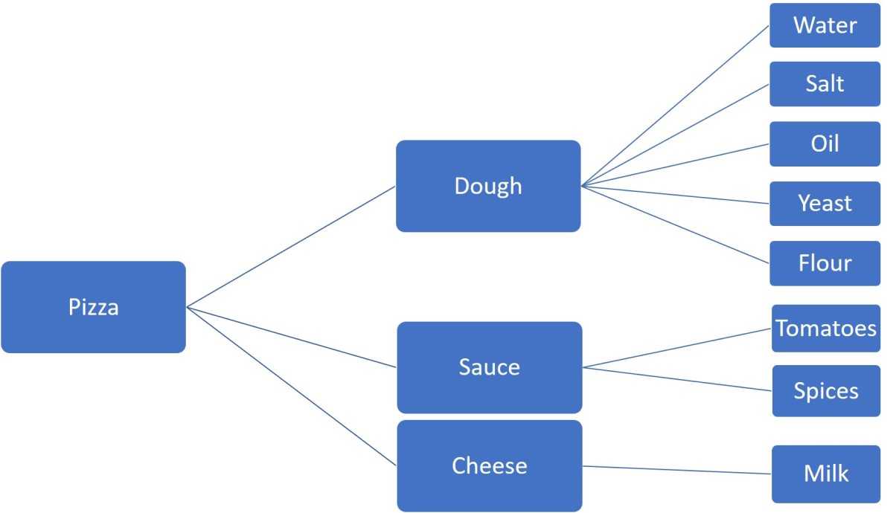

Today, we're going to take a quick look at what's happening under the hood with React.  

The reason for this blogpost is because I was recently presented with this question as part of a technical interview.

To be straightforward - I didn't feel completely prepared to answer the question. This didn't feel good. Having experienced an education in engineering, I've been conditioned to know the why, before knowing the how. (I'm still having PTSD from you, PDEs.) After speaking with several friends of mine with more experience in the field, they too, were unable to produce an answer. It seemed strange, but I suppose we all took React a bit for granted. These days, documentation for the many frameworks we have really don't get into the grit of things. They work more like Ikea manuals - use this function here, and pass these arguments to it. To truly understand, one has to dive into the underlying code.  

However, lets save that for another day :) 

For now, we will just discuss the purpose and benefits of the virtual DOM.

## Document Object Model

Lets take a quick look at what the DOM, or _Document Object Model_ is, and how it works. 
After all, we need to understand what is being improved to see how something else is an improvement. 

Thinking about the name itself - we see 'Object'. Hmm. That's familiar to us. 
When we think about an object in programming, at it's most simplistic level, we think keys and values. 
Lets look at an example object. A pizza, and it's ingredients.

```javascript
const pizza = new Object

pizza.ingredients = {
    "dough",
    "sauce",
    "cheese",
    "toppings",
}

```

Those ingredients listed can be further broken down. Lets do that.

```javascript
pizza.ingredients.dough = {
    "flour",
    "water",
    "yeast",
    "salt",
    "oil",
}

//and so on...

```

To save time, lets take a look visually:



Well, it turns out, you can think of the DOM in sort of the same way. Lets say you have a element. A div for example.
That div may have attributes such as an id, a class, or a name. Then, it also has children. Lets assume our div has a p-tag as a child.